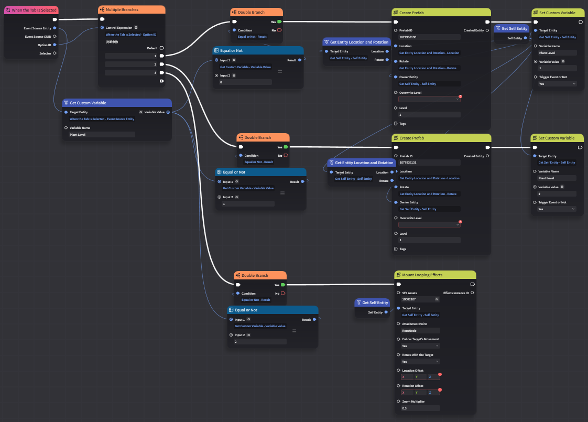
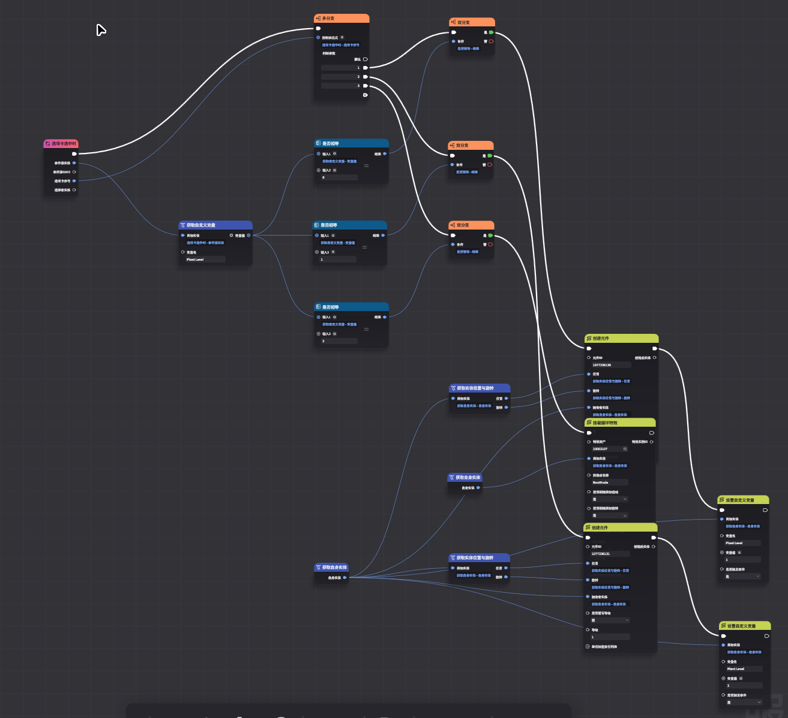

# CI 测试集合

本目录包含项目的持续集成 (CI) 测试套件。测试在 dev 分支同步到 main 分支后自动运行。

---

## 运行机制

### 工作流程

```
dev 推送 ──► sync.yml ──► 同步文件到 main ──► 运行 CI 测试 ──► 上传产物
```

1. **触发**: dev 分支有新推送时自动触发，或手动触发
2. **同步**: 根据 `sync-list.json` 将 dev 文件同步到 main
3. **环境**: 安装 Node.js 24 和项目依赖 (`npm ci`)
4. **测试**: 遍历本目录下所有子文件夹，运行每个 `test.ts`
5. **产物**: 测试输出保存到 `./dist`，打包为 GitHub Actions Artifacts

### 测试执行逻辑 ([index.ts](./index.ts))

```typescript
// 扫描所有测试目录
const tests = readdirSync(SRC)
  .filter(dirent => dirent.isDirectory());

// 逐个执行测试
for (const testName of tests) {
  cpSync(testDir, destDir);         // 复制测试文件
  execSync(`node test.ts`, {cwd});  // 执行测试
}
```

- ✅ 测试通过：继续下一个
- ❌ 测试失败：记录错误，工作流最终失败

---

## 测试列表

| 测试名 | 说明 | 验证内容 |
| :--- | :--- | :--- |
| [`gia_gen`](./gia_gen/) | Graph 接口测试 | 节点图创建、连接、编码 |
| [`parser`](./parser/) | 编译器和反编译器 | DSL → IR → DSL 双向转换 |
| [`compare_data`](./compare_data/) | 静态数据对比 | 与外部参考数据一致性 |
| [`heat_map`](./heat_map/) | 热力图生成 | node_data 数据读取 |
| [`test_graph_analyze`](./test_graph_analyze/) | 图分析算法 | 链、环、孤立点识别 |

---

## 测试详情

### gia_gen — Graph 接口测试

使用 `Graph` 类创建官方教程中的示例节点图，验证节点创建、连接、参数设置和 GIA 编码功能。

**测试内容:**
- 创建多种类型节点（触发器、分支、查询等）
- 执行流和数据流连接
- 参数值设置
- 自动布局算法
- GIA 文件编码

**产物:** `dist/GeneratedGraph.gia`




---

### parser — 编译器和反编译器测试

测试 DSL 解析和反编译的正确性，使用"双重检查"验证往返转换的一致性。

**测试内容:**
- DSL → IR 解析
- IR → DSL 反编译
- 双重转换一致性: `DSL → IR₁ → DSL₁ → IR₂ → DSL₂`
  - 验证 `IR₁ === IR₂`
  - 验证 `DSL₁ === DSL₂`

**产物:** 
- `dist/IR.json` — 解析后的 IR 结构
- `dist/GeneratedDSL.dsl.ts` — 反编译生成的 DSL

---

### compare_data — 静态数据对比

将本项目的节点定义与 [WebMiliastraNodesEditor](https://github.com/Columbina-Dev/WebMiliastraNodesEditor) 项目的数据进行对比。

**测试内容:**
- 节点 ID 匹配
- 节点名称匹配
- 识别差异（缺失、名称不一致等）

**产物:** `dist/server_diff.json`

---

### heat_map — 热力图生成

读取 `node_data/index.json`，生成节点分布热力图。

**图例:**
- 深色: 基类节点
- 浅色: 派生节点
- 不同颜色: 不同类型节点
- 白色: 不存在的节点

**规格:** 100 列 × 37 行 = 3700 个节点位置


---

### test_graph_analyze — 图分析算法测试

随机生成图结构，测试 `analyzeGraph` 函数的正确性。

**测试内容:**
- 随机生成节点和边
- 调用图分析函数
- 验证链识别正确性
- 验证入度/出度计算
- 验证边数一致性

**参数:** 2000 次迭代，最大 100 个节点

---

## 添加新测试

1. 在本目录创建新文件夹
2. 添加 `test.ts` 入口文件
3. 确保可通过 `node test.ts` 运行
4. 可选：添加 `readme.md` 说明
5. 输出文件写入 `./dist/`

**模板:**

```typescript
// test.ts
function main() {
  console.log("Running test...");
  // 测试逻辑
  console.log("Test passed!");
}

if (import.meta.main) {
  main();
}
```

---

## 本地运行

```bash
# 在项目根目录运行单个测试
node .github/actions/CI/gia_gen/test.ts

# 确保 dist 目录存在
mkdir dist
```

---

## 相关链接

- [工作流配置](../workflows/sync.yml) — GitHub Actions 工作流
- [同步配置](../../sync-list.json) — 文件同步规则
- [主 Readme](../../Readme.md) — 项目概述