# Thousand Stars Territory Node Graph Toolset

> [!IMPORTANT]
> Note: The current underlying data and interface framework has been refactored v2. The main interfaces are basically unchanged, but the internal structure has been almost entirely adjusted. If you are using code from 2025, please upgrade as soon as possible. Subsequent interfaces and data may not stably support past usage.

<div align="center">

[Chinese Documentation](Readme.en.md) | [English Documentation](Readme.en.en.md)

[](./LICENSE)
[](https://www.typescriptlang.org/)
[](https://nodejs.org/)

**Comprehensive Toolset for Genshin Impact Thousand Stars Territory Node Graph Development**

*A complete solution from underlying file parsing to upper-level code writing*

[Quick Start](#quick-start) · [Core Features](#core-features) · [Documentation](#module-documentation) · [Development Progress](#development-progress)

</div>

---

## ✨ Feature Highlights

- 🔧 **GIA File Read/Write** — Programmatically read and write `gia` node graph files using TypeScript
- 📝 **DSL Code Language** — Describe node graphs in code, enjoying IDE intelligent completion and syntax highlighting
- 🔄 **Bi-directional Converter** — Full compilation/decompilation toolchain: DSL ⇔ IR ⇔ GIA
- 📊 **Comprehensive Node Data** — Centralized data management, 500+ node definitions, complete type system
- 🧩 **High-level API** — `Graph` class encapsulation for easy construction and modification of node graphs
- 🎯 **Type Safety** — Comprehensive TypeScript type definitions and compile-time checks
- 🔍 **Reverse Engineering Tools** — Complete Protobuf validation and analysis toolchain

---

## Core Features

### 1. GIA File Read/Write

Programmatically read and write `.gia` files using TypeScript, supporting full encoding/decoding and graph operations.

```typescript
import { Graph, NODES } from "./utils/index.ts";
import { decode_gia_file, encode_gia_file } from "./utils/protobuf/decode.ts";

// Read existing file
const bundle = decode_gia_file("input.gia");
const graph = Graph.decode(bundle);

// Or create a new graph
const newGraph = new Graph("ENTITY_NODE_GRAPH");
const trigger = newGraph.add_node(NODES.Trigger_Tab_OnTabSelect);
const branch = newGraph.add_node(NODES.Control_General_Branch);

// Connect nodes
newGraph.flow(trigger, branch);
newGraph.connect(trigger, branch, "Output0", "cond");
branch.setVal("cond", true);

// Auto-layout and save
newGraph.autoLayout();
encode_gia_file("output.gia", newGraph.encode());
```

📖 Details: [GIA Generator](./utils/gia_gen/readme.en.md) | [Protobuf Tools](./utils/protobuf/readme.en.md) | [Node Data](./utils/node_data/readme.en.md)

### 2. DSL Code Writing

Use a TypeScript-based Domain Specific Language (DSL) to describe node graph logic in code, enjoying IDE intelligent completion, syntax highlighting, and version control advantages.

```typescript
// Triggered when the game object is created
[OnCreate()]
  .Log("I'm alive!")
  .SetVal(Self.hp, 10000);

// Triggered upon receiving a signal
[Signal(Signal.PlayerHit)[dmg]]
  .$((dmg) => dmg * node.critical)[real_dmg]
  .SetVal(Self.hp, Self.hp - real_dmg)
  .If(Self.hp <= 0)(
    true = Log("You died"),
    false = Log("Ouch!")
  );

// Loop and Branching
[Timer(Timer.countdown)]
  .Loop(0n, 9n, "spawn")[i](
    true = SpawnEnemy(i),
    false = Log("All spawned") >> 0()
  ).Log("Loop complete");
```

📖 Details: [DSL User Guide](./docs/UserGuide.en.md) | [Language Design](./docs/SystemDesign.en.md)

### 3. Parser and Converter

A complete compilation/decompilation toolchain supporting mutual conversion between DSL text, Intermediate Representation (IR), and GIA node graphs.

```typescript
import { createParserState, parse, decompile } from "./src/parser";
import { giaIrConvertor } from "./src/convertor";

// DSL → IR
const state = createParserState(sourceCode);
const ir = parse(state);

// IR → DSL
const code = decompile(ir);

// GIA → IR
const irModule = giaIrConvertor(giaGraph, true);
```


📖 Details: [Parser](./src/parser/readme.en.md) | [Converter](./src/convertor/readme.en.md) | [IR Types](./src/types/readme.en.md)

### 4. Comprehensive Node Data

A thoroughly refactored centralized data system where all node definitions, type systems, and enum values are uniformly managed in [data.json](./utils/node_data/data.json).

```typescript
import { NodeLib, NODES } from "./utils/node_data/index.ts";

// Use node constants (with full documentation comments)
const branchNode = NODES.Control_General_Branch;

// Query node definition
const nodeDef = NodeLib.getByIdentifier(branchNode);
console.log(nodeDef.InGameName.en);    // "Double Branch"
console.log(nodeDef.DataPins.length);  // Number of data pins

// Handle variable type nodes
const intEqual = NodeLib.getVariant(
  NODES.Arithmetic_General_Equal,
  "C<T:Int>"
);
console.log(intEqual.DataPins[0].Type); // "Int" (Specialized)
```

**Core Data:**
- [data.json](./utils/node_data/data.json) - Complete node data (~3.8MB, 500+ node definitions)
- [game_nodes.ts](./utils/node_data/game_nodes.ts) - Auto-generated node constants (with full documentation comments)
- Complete type system (type parsing, conversion, reflection)
- Multi-language support (14 languages localization)

📖 Details: [Node Data System](./utils/node_data/readme.en.md)

---

## Project Structure

```
.
├── src/                          # Core source code
│   ├── convertor/                # GIA ⇔ IR Converter
│   │   ├── gia_ir.ts             #     GIA → IR conversion entry point
│   │   ├── gia_ir_raw.ts         #     Raw IR builder
│   │   └── graph_chain_split.ts  #     Graph structure analysis algorithm
│   ├── parser/                   # DSL Parser
│   │   ├── tokenizer.ts          #     Lexical analysis
│   │   ├── parser.ts             #     Syntactic analysis
│   │   ├── decompiler.ts         #     IR → DSL Decompilation
│   │   └── parse_*.ts            #     Sub-parsers
│   └── types/                    # IR type definitions
│       ├── IR*.ts                #     IR node types
│       ├── types.ts              #     Basic types
│       └── consts.ts             #     Constant definitions
│
├── utils/                        # Utility library (refactored)
│   ├── gia_gen/                  # GIA Graph Generator
│   │   ├── interface.ts          #     Core API (Graph/Node classes)
│   │   ├── core.ts               #     Underlying encoding/decoding functions
│   │   ├── auto_layout.ts        #     Auto-layout algorithm
│   │   ├── example.ts            #     Complete usage example
│   │   └── display/              #     Visualization tools
│   ├── node_data/                # Node static data (centralized)
│   │   ├── data.json             #     Complete node data (~3.8MB)
│   │   ├── types.ts              #     Data structure type definitions
│   │   ├── node_type.ts          #     Type system core
│   │   ├── core.ts               #     Type conversion and query
│   │   ├── instances.ts          #     Data access classes
│   │   ├── game_nodes.ts         #     Node constants (auto-generated)
│   │   ├── gen_game_nodes.ts     #     Convenient interface generator
│   │   └── UGC-Guide-Markdown/   #     Official documentation extraction results
│   ├── protobuf/                 # Protobuf toolset
│   │   ├── gia.proto             #     Core Protobuf definition
│   │   ├── gia.proto.ts          #     Auto-generated TS types
│   │   ├── decode.ts             #     Production encoding/decoding
│   │   ├── decode-cli.ts         #     Debugging/Reverse engineering tool
│   │   ├── decode_raw.ts         #     Raw Protobuf parsing
│   │   ├── proto2ts.ts           #     Proto → TS generator
│   │   └── verify_proto.ts       #     Structure validator
│   ├── functions/                # DSL function definitions (low priority)
│   ├── index.ts                  # Unified export interface
│   ├── utils.ts                  # General utility functions
│   └── gen_def.ts                # DSL type generator (low priority)
│
├── docs/                         # User documentation
│   ├── UserGuide.md              # DSL User Manual
│   ├── SystemDesign.md           # Language Design Document
│   └── dsl.enbf                  # DSL Grammar Specification
│
├── test.CI/                      # CI test cases
└── static/                       # Image resources
```

---

## Quick Start

### Environment Requirements

- **Node.js** 23.6+
- **npm** or **pnpm**

### Install Dependencies

```bash
npm install
```

### Quick Usage

**1. Read and Modify an Existing GIA File**

```typescript
import { decode_gia_file, encode_gia_file, Graph } from "./utils/index.ts";

const bundle = decode_gia_file("myGraph.gia");
const graph = Graph.decode(bundle);

// Modify nodes
graph.nodes.forEach(node => {
  console.log(`Node: ${node.def.Identifier}`);
});

// Add a new node
const newNode = graph.add_node(NODES.Control_General_Branch);

// Save
encode_gia_file("myGraph_modified.gia", graph.encode());
```

**2. Create a Node Graph from Scratch**

```typescript
import { Graph, NODES, encode_gia_file } from "./utils/index.ts";

const graph = new Graph("ENTITY_NODE_GRAPH");

// Add trigger and function nodes
const trigger = graph.add_node(NODES.Trigger_Tab_OnTabSelect);
const getVar = graph.add_node(NODES.Query_CustomVariable_GetVariable);
const branch = graph.add_node(NODES.Control_General_Branch);

// Connect execution flow
graph.flow(trigger, branch);

// Connect data flow
graph.connect(trigger, getVar, 0, 0);
graph.connect(getVar, branch, 0, "cond");

// Set parameters
getVar.setVal("var_name", "Player Level");

// Layout and save
graph.autoLayout();
encode_gia_file("newGraph.gia", graph.encode());
```

**3. Query Node Data**

```typescript
import { NodeLib, NODES } from "./utils/node_data/index.ts";

// Query node definition
const nodeDef = NodeLib.getByIdentifier(NODES.Control_General_Branch);

console.log(nodeDef.InGameName.en);  // "Double Branch"
console.log(nodeDef.System);         // "Server"
console.log(nodeDef.Domain);         // "Control"

// Iterate through pins
nodeDef.DataPins.forEach(pin => {
  console.log(`${pin.Identifier}: ${pin.Type}`);
});
```

---

## Module Documentation

### Core Modules

| Module | Description | Documentation |
| :--- | :--- | :--- |
| **Source Code** | Parser, Converter, IR Type Definitions | [src/readme.md](./src/readme.en.md) |
| **Utility Library** | GIA Generation, Node Data, Protobuf | [utils/readme.md](./utils/readme.en.md) |

### Utility Modules (Refactored)

| Module | Description | Documentation |
| :--- | :--- | :--- |
| **GIA Generator** | Programmatically build and manipulate node graphs | [gia_gen/readme.md](./utils/gia_gen/readme.en.md) |
| **Node Data System** | Centralized data management, complete type system | [node_data/readme.md](./utils/node_data/readme.en.md) |
| **Protobuf Toolset** | Bi-directional encoding/decoding, reverse engineering toolchain | [protobuf/readme.md](./utils/protobuf/readme.en.md) |
| **DSL Functions** | Math/Query node definitions (low priority) | [functions/readme.md](./utils/functions/readme.en.md) |

### Source Code Modules

| Module | Description | Documentation |
| :--- | :--- | :--- |
| **Parser** | DSL lexical analysis, syntactic analysis, decompilation | [parser/readme.md](./src/parser/readme.en.md) |
| **Converter** | GIA ⇔ IR format conversion, graph analysis algorithms | [convertor/readme.md](./src/convertor/readme.en.md) |
| **Type Definitions** | IR node types, Tokens, Constants | [types/readme.md](./src/types/readme.en.md) |

### User Documentation

| Document | Description |
| :--- | :--- |
| [DSL User Guide](./docs/UserGuide.en.md) | Complete guide to DSL syntax |
| [Language Design](./docs/SystemDesign.en.md) | Design philosophy and implementation details of the language |
| [TODO.md](./TODO.en.md) | Development plan and progress tracking |

---

## Toolchain Workflow

### Complete Data Flow


### Typical Use Cases

**Scenario 1: Reading and Modifying a GIA File**


**Scenario 2: Creating a Node Graph from Scratch**


**Scenario 3: DSL Code Compilation (In Progress)**

```mermaid
flowchart LR
    A[DSL Code] -->|createParserState| B[Token Stream]
    B -->|parse| C[IR AST]
    C -->|IR → Graph<br/>Incomplete| D[Graph Object]
    D -->|encode| E[AssetBundle]
    E -->|encode_gia_file| F[GIA File]
    
    style C fill:#fff3e0
    style D fill:#ffccbc
```


**Scenario 4: GIA Decompilation to DSL (In Progress)**


---

## GIA File Format

The `.gia` file is the binary storage format for Genshin Impact's Thousand Stars Territory node graphs, serialized using Protobuf.


| Field | Offset | Value | Description |
| :--- | :--- | :--- | :--- |
| File Size | 0x00 | `size - 4` | Total file size minus 4 bytes |
| Version | 0x04 | `0x01` | Fixed value |
| Header Marker | 0x08 | `0x0326` | **Strictly validated** |
| File Type | 0x0C | `0x03` | GIA = 3 |
| Content Length | 0x10 | `size - 24` | Protobuf data length |
| Protobuf | 0x14 | ... | Serialized node graph data |
| Footer Marker | End | `0x0679` | **Strictly validated** |

📖 Protobuf Detailed Structure: [gia.proto](./utils/protobuf/gia.proto) | [Reverse Engineering Tool Documentation](./utils/protobuf/readme.en.md)

---

## Development Progress

### Completed ✅

| Feature | Status | Description |
| :--- | :--- | :--- |
| **Data System Refactor** | ✅ Completed | Centralized data.json, complete type system |
| GIA File Reverse Engineering | ✅ Completed | Complete file format parsing |
| GIA File Read/Write Interface | ✅ Completed | TypeScript bi-directional encoding/decoding |
| Graph High-level API | ✅ Completed | Node, connection, comment, variable management |
| Protobuf Reverse Engineering Toolchain | ✅ Completed | decode_raw, proto2ts, verify_proto |
| DSL Syntax Design | ✅ Completed | Complete syntax specification |
| DSL → IR Parser | ✅ Completed | Lexical analysis + Syntactic analysis |
| IR → DSL Decompiler | ✅ Completed | Full decompilation support |
| Auto-layout Algorithm | ✅ Completed | Dagre-based auto-layout |
| Node Data Organization | ✅ Completed | 500+ nodes, 100+ enums |
| CI Automated Testing | ✅ Completed | Parser consistency testing |

### In Progress ⏳

| Feature | Status | Description |
| :--- | :--- | :--- |
| GIA → IR Converter | ⏳ In Progress | Raw mode supported, optimizing |
| IR → GIA Converter | ⏳ In Progress | Constructing Graph from IR |
| Client Node Support | ⏳ In Progress | Handling ID and enum differences |
| Documentation Update | ⏳ In Progress | Adapting to refactored new interfaces |

### Planned 📋

| Feature | Description |
| :--- | :--- |
| VSCode Language Extension | Syntax highlighting and intelligent completion for `.dsl.ts` files |
| Compiler Type Inference | Automatic type inference for DSL expressions |
| Runtime Simulation | Local simulation of node graph logic execution |

See [TODO.md](./TODO.en.md) for more plans.

---

## Related Projects

| Project | Description |
| :--- | :--- |
| [WebMiliastraNodesEditor](https://github.com/Columbina-Dev/WebMiliastraNodesEditor) | Web-based node editor |
| [genshin-miliastra-file-format](https://github.com/script-1024/genshin-miliastra-file-format) | Introduction to other file formats like `gil` |
| [GIScriptEditor](https://github.com/hackermdch/GIScriptEditor) | Another DSL design, has implemented **non-equivalent** DSL overlaying onto GIL files, and provides a custom UgcUtil interface. Further refinement of GIL parsing is needed. |

*Simulation automation tools using visual solutions are not listed.*

---

## Contributing

Contributions, bug reports, or suggestions are welcome!

- 🐛 **Bug Reports**：[Submit an Issue](https://github.com/Wu-Yijun/Genshin-Impact-Miliastra-Wonderland-Code-Node-Editor-Pack/issues)
- 💡 **Feature Suggestions**：[Submit an Issue](https://github.com/Wu-Yijun/Genshin-Impact-Miliastra-Wonderland-Code-Node-Editor-Pack/issues)
- 📧 **Contact Author**：[wuyijun21@mails.ucas.ac.cn](mailto:wuyijun21@mails.ucas.ac.cn)

## License

[MIT License](./LICENSE) © 2025-2026 Wu-Yijun