# 千星奇域节点图工具集

> [!IMPORTANT]  
> 注意:当前的底层数据与接口框架经过了重构v2, 主要接口基本没变, 但是内部结构几乎全部被调整了, 如果你使用了 2025 年的代码, 请尽早升级, 后续的接口与数据可能无法稳定支持过去的用法.

<div align="center">

[中文文档](Readme.md) | [English Documentation](Readme.en.md)

[](./LICENSE)
[](https://www.typescriptlang.org/)
[](https://nodejs.org/)

**原神千星奇域节点图开发的综合工具集**

*从底层文件解析到上层代码编写的全套解决方案*

[快速开始](#快速开始) · [核心功能](#核心功能) · [文档](#模块文档) · [开发进度](#开发进度)

</div>

---

## ✨ 特性亮点

- 🔧 **GIA 文件读写** — 使用 TypeScript 编程式读写 `gia` 节点图文件
- 📝 **DSL 代码语言** — 以代码形式描述节点图，享受 IDE 智能补全和语法高亮
- 🔄 **双向转换器** — DSL ⇔ IR ⇔ GIA 完整编译/反编译工具链
- 📊 **完备节点数据** — 集中式数据管理，500+ 节点定义，完整类型系统
- 🧩 **高层 API** — `Graph` 类封装，轻松构建和修改节点图
- 🎯 **类型安全** — 全面的 TypeScript 类型定义和编译时检查
- 🔍 **逆向工具** — 完整的 Protobuf 验证与分析工具链

---

## 核心功能

### 1. GIA 文件读写

使用 TypeScript 编程式读写 `.gia` 文件，支持完整的编解码和图操作。

```typescript
import { Graph, NODES } from "./utils/index.ts";
import { decode_gia_file, encode_gia_file } from "./utils/protobuf/decode.ts";

// 读取现有文件
const bundle = decode_gia_file("input.gia");
const graph = Graph.decode(bundle);

// 或创建新图
const newGraph = new Graph("ENTITY_NODE_GRAPH");
const trigger = newGraph.add_node(NODES.Trigger_Tab_OnTabSelect);
const branch = newGraph.add_node(NODES.Control_General_Branch);

// 连接节点
newGraph.flow(trigger, branch);
newGraph.connect(trigger, branch, "Output0", "cond");
branch.setVal("cond", true);

// 自动布局并保存
newGraph.autoLayout();
encode_gia_file("output.gia", newGraph.encode());
```

📖 详情：[GIA 生成器](./utils/gia_gen/readme.md) | [Protobuf 工具](./utils/protobuf/readme.md) | [节点数据](./utils/node_data/readme.md)

### 2. DSL 代码编写

使用基于 TypeScript 的领域特定语言 (DSL) 以代码方式描述节点图逻辑，享受 IDE 智能补全、语法高亮和版本控制优势。

```typescript
// 游戏对象创建时触发
[OnCreate()]
  .Log("I'm alive!")
  .SetVal(Self.hp, 10000);

// 收到信号时触发
[Signal(Signal.PlayerHit)[dmg]]
  .$((dmg) => dmg * node.critical)[real_dmg]
  .SetVal(Self.hp, Self.hp - real_dmg)
  .If(Self.hp <= 0)(
    true = Log("You died"),
    false = Log("Ouch!")
  );

// 循环与分支
[Timer(Timer.countdown)]
  .Loop(0n, 9n, "spawn")[i](
    true = SpawnEnemy(i),
    false = Log("All spawned") >> 0()
  ).Log("Loop complete");
```

📖 详情：[DSL 使用手册](./docs/UserGuide.md) | [语言设计](./docs/SystemDesign.md)

### 3. 解析器与转换器

完整的编译/反编译工具链，支持 DSL 文本、中间表示 (IR) 和 GIA 节点图之间的相互转换。

```typescript
import { createParserState, parse, decompile } from "./src/parser";
import { giaIrConvertor } from "./src/convertor";

// DSL → IR
const state = createParserState(sourceCode);
const ir = parse(state);

// IR → DSL
const code = decompile(ir);

// GIA → IR
const irModule = giaIrConvertor(giaGraph, true);
```



```mermaid
graph LR
    Raw[二进制<br/>原始文件]
    GIA[Graph<br/>接口]
    IR[IR<br/>AST]
    DSL[DSL<br/>代码]

    Raw -- "decode/gia_gen" --> GIA
    GIA -- "gia_gen/encode" --> Raw

    %% IR 与 GIA 的转换
    IR -- "正在实现" --> GIA
    GIA -- "gia Ir Convertor(工作中)" --> IR

    %% DSL 与 IR 的转换
    DSL -- "parse" --> IR
    IR -- "decompile" --> DSL

```

📖 详情：[解析器](./src/parser/readme.md) | [转换器](./src/convertor/readme.md) | [IR 类型](./src/types/readme.md)

### 4. 完备的节点数据

经过彻底重构的集中式数据系统，所有节点定义、类型系统、枚举值统一管理在 [data.json](./utils/node_data/data.json) 中。

```typescript
import { NodeLib, NODES } from "./utils/node_data/index.ts";

// 使用节点常量（带完整文档注释）
const branchNode = NODES.Control_General_Branch;

// 查询节点定义
const nodeDef = NodeLib.getByIdentifier(branchNode);
console.log(nodeDef.InGameName.en);    // "Double Branch"
console.log(nodeDef.DataPins.length);  // 数据引脚数量

// 处理可变类型节点
const intEqual = NodeLib.getVariant(
  NODES.Arithmetic_General_Equal,
  "C<T:Int>"
);
console.log(intEqual.DataPins[0].Type); // "Int" (已具体化)
```

**核心数据：**
- [data.json](./utils/node_data/data.json) - 完整节点数据（~3.8MB，500+ 节点定义）
- [game_nodes.ts](./utils/node_data/game_nodes.ts) - 自动生成的节点常量（带完整文档注释）
- 完整的类型系统（类型解析、转换、反射）
- 多语言支持（14 种语言本地化）

📖 详情：[节点数据系统](./utils/node_data/readme.md)

---

## 项目结构

```
.
├── src/                          # 核心源代码
│   ├── convertor/                # GIA ⇔ IR 转换器
│   │   ├── gia_ir.ts             #     GIA → IR 转换入口
│   │   ├── gia_ir_raw.ts         #     原始 IR 构建器
│   │   └── graph_chain_split.ts  #     图结构分析算法
│   ├── parser/                   # DSL 解析器
│   │   ├── tokenizer.ts          #     词法分析
│   │   ├── parser.ts             #     语法分析
│   │   ├── decompiler.ts         #     IR → DSL 反编译
│   │   └── parse_*.ts            #     子解析器
│   └── types/                    # IR 类型定义
│       ├── IR*.ts                #     IR 节点类型
│       ├── types.ts              #     基础类型
│       └── consts.ts             #     常量定义
│ 
├── utils/                        # 工具库（已重构）
│   ├── gia_gen/                  # GIA 图生成器
│   │   ├── interface.ts          #     核心 API (Graph/Node 类)
│   │   ├── core.ts               #     底层编解码函数
│   │   ├── auto_layout.ts        #     自动布局算法
│   │   ├── example.ts            #     完整使用示例
│   │   └── display/              #     可视化工具
│   ├── node_data/                # 节点静态数据（集中式）
│   │   ├── data.json             #     完整节点数据 (~3.8MB)
│   │   ├── types.ts              #     数据结构类型定义
│   │   ├── node_type.ts          #     类型系统核心
│   │   ├── core.ts               #     类型转换和查询
│   │   ├── instances.ts          #     数据访问类
│   │   ├── game_nodes.ts         #     节点常量（自动生成）
│   │   ├── gen_game_nodes.ts     #     便捷接口生成器
│   │   └── UGC-Guide-Markdown/   #     官方文档提取结果
│   ├── protobuf/                 # Protobuf 工具集
│   │   ├── gia.proto             #     核心 Protobuf 定义
│   │   ├── gia.proto.ts          #     自动生成的 TS 类型
│   │   ├── decode.ts             #     生产环境编解码
│   │   ├── decode-cli.ts         #     调试/逆向工具
│   │   ├── decode_raw.ts         #     原始 Protobuf 解析
│   │   ├── proto2ts.ts           #     Proto → TS 生成器
│   │   └── verify_proto.ts       #     结构验证器
│   ├── functions/                # DSL 函数定义（低优先级）
│   ├── index.ts                  # 统一导出接口
│   ├── utils.ts                  # 通用工具函数
│   └── gen_def.ts                # DSL 类型生成器（低优先级）
│
├── docs/                         # 用户文档
│   ├── UserGuide.md              # DSL 使用手册
│   ├── SystemDesign.md           # 语言设计文档
│   └── dsl.enbf                  # DSL 语法规范
│
├── test.CI/                      # CI 测试用例
└── static/                       # 图片资源
```

---

## 快速开始

### 环境要求

- **Node.js** 23.6+
- **npm** 或 **pnpm**

### 安装依赖

```bash
npm install
```

### 快速使用

**1. 读取并修改现有 GIA 文件**

```typescript
import { decode_gia_file, encode_gia_file, Graph } from "./utils/index.ts";

const bundle = decode_gia_file("myGraph.gia");
const graph = Graph.decode(bundle);

// 修改节点
graph.nodes.forEach(node => {
  console.log(`节点: ${node.def.Identifier}`);
});

// 添加新节点
const newNode = graph.add_node(NODES.Control_General_Branch);

// 保存
encode_gia_file("myGraph_modified.gia", graph.encode());
```

**2. 从零创建节点图**

```typescript
import { Graph, NODES, encode_gia_file } from "./utils/index.ts";

const graph = new Graph("ENTITY_NODE_GRAPH");

// 添加触发器和功能节点
const trigger = graph.add_node(NODES.Trigger_Tab_OnTabSelect);
const getVar = graph.add_node(NODES.Query_CustomVariable_GetVariable);
const branch = graph.add_node(NODES.Control_General_Branch);

// 连接执行流
graph.flow(trigger, branch);

// 连接数据流
graph.connect(trigger, getVar, 0, 0);
graph.connect(getVar, branch, 0, "cond");

// 设置参数
getVar.setVal("var_name", "Player Level");

// 布局并保存
graph.autoLayout();
encode_gia_file("newGraph.gia", graph.encode());
```

**3. 查询节点数据**

```typescript
import { NodeLib, NODES } from "./utils/node_data/index.ts";

// 查询节点定义
const nodeDef = NodeLib.getByIdentifier(NODES.Control_General_Branch);

console.log(nodeDef.InGameName.en);  // "Double Branch"
console.log(nodeDef.System);         // "Server"
console.log(nodeDef.Domain);         // "Control"

// 遍历引脚
nodeDef.DataPins.forEach(pin => {
  console.log(`${pin.Identifier}: ${pin.Type}`);
});
```

---

## 模块文档

### 核心模块

| 模块 | 说明 | 文档 |
| :--- | :--- | :--- |
| **源代码** | 解析器、转换器、IR 类型定义 | [src/readme.md](./src/readme.md) |
| **工具库** | GIA 生成、节点数据、Protobuf | [utils/readme.md](./utils/readme.md) |

### 工具模块（已重构）

| 模块 | 说明 | 文档 |
| :--- | :--- | :--- |
| **GIA 生成器** | 编程式构建和操作节点图 | [gia_gen/readme.md](./utils/gia_gen/readme.md) |
| **节点数据系统** | 集中式数据管理，完整类型系统 | [node_data/readme.md](./utils/node_data/readme.md) |
| **Protobuf 工具集** | 双路径编解码，逆向工程工具链 | [protobuf/readme.md](./utils/protobuf/readme.md) |
| **DSL 函数** | Math/Query 节点定义（低优先级） | [functions/readme.md](./utils/functions/readme.md) |

### 源代码模块

| 模块 | 说明 | 文档 |
| :--- | :--- | :--- |
| **解析器** | DSL 词法分析、语法分析、反编译 | [parser/readme.md](./src/parser/readme.md) |
| **转换器** | GIA ⇔ IR 格式转换，图分析算法 | [convertor/readme.md](./src/convertor/readme.md) |
| **类型定义** | IR 节点类型、Token、常量 | [types/readme.md](./src/types/readme.md) |

### 用户文档

| 文档 | 说明 |
| :--- | :--- |
| [DSL 使用手册](./docs/UserGuide.md) | DSL 语法完整指南 |
| [语言设计](./docs/SystemDesign.md) | 语言设计理念和实现细节 |
| [TODO.md](./TODO.md) | 开发计划和进度跟踪 |

---

## 工具链工作流程

### 完整数据流

```mermaid
graph LR
    %% === 顶层：文件输入/输出 ===
    subgraph Files ["📂 文件接口"]
        direction LR
        BinFile([GIA Binary])
        TextFile([DSL Code])
    end

    %% === 核心处理层 ===
    subgraph Process ["⚙️ 核心处理流程"]
        direction TB
        
        %% 左侧：二进制处理流
        subgraph BinaryFlow ["二进制/运行时处理"]
            direction TB
            Codec[Protobuf <br/>编解码器]
            GraphBuild[图构建<br/>与布局]
            
            Codec --Graph数据--> GraphBuild
            GraphBuild --Graph对象--> Codec
        end
        
        %% 中间：转换桥梁
        subgraph Bridge ["🔄 转换核心"]
            direction TB
            Converter[GIA-IR <br/>转换器]
            Splitter[链路分析]
            
            Splitter -.辅助.-> Converter
        end

        %% 右侧：文本处理流
        subgraph TextFlow ["编译/文本处理"]
            direction TB
            Parser[解析器 <br/>Parser]
            Decompiler[反编译器]
            IR_Def[IR <br/>类型定义]
            
            Parser --AST--> IR_Def
            IR_Def --IR--> Decompiler
        end
    end

    %% === 底层：公共依赖 ===
    subgraph Base ["📚 基础架构层"]
        direction LR
        DataCore[数据定义<br/>Core]
        TypeSys[类型系统<br/>TypeEngine]
    end

    %% === 连线关系 ===

    %% 1. 文件 I/O
    TextFile ==> Parser
    Decompiler ==> TextFile
    BinFile <==> Codec   

    %% 2. 内部数据流 (关键路径)
    GraphBuild <== Graph对象/IR ==> Converter
    Converter <== IR结构 ==> IR_Def

    %% 3. 基础层支撑 (虚线)
    Base -.-> BinaryFlow
    Base -.-> TextFlow
    Base -.-> Bridge

    %% === 样式调整 ===
    classDef file fill:#37474f,stroke:#fff,stroke-width:2px,color:#fff
    classDef flow fill:#e3f2fd,stroke:#1565c0,stroke-width:0px
    classDef core fill:#fff3e0,stroke:#ef6c00,stroke-width:2px
    classDef base fill:#f3e5f5,stroke:#7b1fa2,stroke-width:1px,stroke-dasharray: 5 5

    class BinFile,TextFile file
    class Codec,GraphBuild,Parser,Decompiler,Converter,Splitter,IR_Def flow
    class Converter,IR_Def core
    class DataCore,TypeSys base
```



### 典型使用场景

**场景 1：读取并修改 GIA 文件**

```mermaid
sequenceDiagram
    participant GIA as GIA 文件
    participant Decode as decode.ts
    participant Graph as Graph 类
    participant NodeLib as NodeLib
    participant Encode as encode.ts
    
    GIA->>Decode: 读取二进制文件
    Decode->>Decode: unwrap_gia()<br/>解析文件头
    Decode->>Decode: protobuf.decode()<br/>解析 Protobuf
    Decode->>Graph: AssetBundle 对象
    Graph->>Graph: Graph.decode()<br/>构建节点图对象
    Graph->>NodeLib: 查询节点定义
    NodeLib-->>Graph: NodeDef
    Note over Graph: 修改节点<br/>add_node()<br/>connect()<br/>setVal()
    Graph->>Graph: autoLayout()<br/>自动布局
    Graph->>Encode: graph.encode()<br/>生成 AssetBundle
    Encode->>Encode: protobuf.encode()<br/>序列化
    Encode->>Encode: wrap_gia()<br/>添加文件头
    Encode->>GIA: 写入文件
```


**场景 2：从零创建节点图**

```mermaid
sequenceDiagram
    participant User as 用户代码
    participant NODES as game_nodes.ts
    participant Graph as Graph 类
    participant Node as Node 实例
    participant Layout as auto_layout.ts
    participant File as GIA 文件
    
    User->>Graph: new Graph("ENTITY_NODE_GRAPH")
    User->>NODES: 获取节点常量<br/>NODES.Control_General_Branch
    User->>Graph: add_node(NODES.xxx)
    Graph->>Node: 创建 Node 实例
    User->>Graph: flow(nodeA, nodeB)
    Graph->>Graph: 创建控制流连接
    User->>Graph: connect(nodeA, nodeB, "out", "in")
    Graph->>Graph: 创建数据流连接
    User->>Node: setVal("pin", value)
    Node->>Node: 设置引脚值
    User->>Graph: autoLayout()
    Graph->>Layout: 计算节点位置
    Layout-->>Graph: 布局结果
    User->>Graph: encode()
    Graph-->>User: AssetBundle
    User->>File: encode_gia_file()
```


**场景 3：DSL 代码编译（工作中）**

```mermaid
flowchart LR
    A[DSL 代码] -->|createParserState| B[Token 流]
    B -->|parse| C[IR AST]
    C -->|IR → Graph<br/>未完成| D[Graph 对象]
    D -->|encode| E[AssetBundle]
    E -->|encode_gia_file| F[GIA 文件]
    
    style C fill:#fff3e0
    style D fill:#ffccbc
```


**场景 4：GIA 反编译为 DSL（工作中）**

```mermaid
flowchart LR
    A[GIA 文件] -->|decode_gia_file| B[AssetBundle]
    B -->|Graph.decode| C[Graph 对象]
    C -->|giaIrConvertor<br/>工作中| D[IR Module]
    D -->|decompile| E[DSL 代码]
    
    style D fill:#fff3e0
    style E fill:#c8e6c9
```


---

## GIA 文件格式

`.gia` 文件是原神千星奇域节点图的二进制存储格式，使用 Protobuf 序列化。

```mermaid
classDiagram
    %% === 1. 文件容器层 ===
    class AssetBundle {
        +ResourceEntry primary_resource
        +ResourceEntry[] dependencies
        +string export_tag
    }
    class ResourceEntry {
        +ResourceLocator identity
        +ResourceClass class
        +OneOf payload
    }
    
    %% === 2. 逻辑图层 ===
    class NodeGraph {
        +ResourceLocator identity
        +NodeInstance[] nodes
        +GraphVariable[] blackboard
        +InterfaceMapping[] port_mappings
    }
    
    %% === 3. 节点实例层 ===
    class NodeInstance {
        +int32 index
        +ResourceLocator shell_ref (UI定义)
        +ResourceLocator kernel_ref (逻辑实现)
        +PinInstance[] pins
    }
    
    %% === 4. 引脚与连接层 ===
    class PinInstance {
        +PinSignature shell_sig
        +PinSignature kernel_sig
        +NodeConnection[] connections
        +TypedValue value
    }
    
    class NodeConnection {
        +int target_node_index
        +PinSignature target_pin
    }

    %% === 5. 数值与类型层 ===
    class TypedValue {
        +WidgetType ui_widget
        +OneOf storage
    }
    
    class ResourceLocator {
        +Origin source
        +Category category
        +AssetKind kind
        +long asset_guid
        +long runtime_id
    }

    %% === 关系连线 ===
    AssetBundle *-- ResourceEntry : 包含
    ResourceEntry *-- NodeGraph : Payload
    ResourceEntry o-- ResourceLocator : 自身ID
    
    NodeGraph *-- NodeInstance : 包含节点
    NodeInstance *-- PinInstance : 包含引脚
    NodeInstance *-- TypedValue : 存储值
    NodeInstance *-- ResourceLocator : 引用定义
    
    PinInstance *-- NodeConnection : 包含连线
    PinInstance *-- TypedValue : 存储值
    
    NodeGraph o-- ResourceLocator : 自身ID
    
    %% === 样式定义 (优化版: 柔和色系) ===
    
    %% 文件层 - 淡灰 (冷静的基础色)
    style AssetBundle fill:#eceff1,stroke:#546e7a,stroke-width:2px,color:#000
    
    %% 资源层 - 淡蓝 (清新的逻辑容器)
    style ResourceEntry fill:#e3f2fd,stroke:#1e88e5,stroke-width:2px,color:#000
    
    %% 图结构层 - 淡橙 (温暖的核心区域)
    style NodeGraph fill:#fff3e0,stroke:#fb8c00,stroke-width:2px,color:#000
    
    %% 节点细节层 - 淡绿 (生机勃勃的实例)
    style NodeInstance fill:#e8f5e9,stroke:#43a047,color:#000
    style PinInstance fill:#e8f5e9,stroke:#43a047,color:#000
    style NodeConnection fill:#e8f5e9,stroke:#43a047,color:#000
    
    %% 数据层 - 淡紫 (抽象的数据定义)
    style TypedValue fill:#f3e5f5,stroke:#8e24aa,color:#000
    style ResourceLocator fill:#f3e5f5,stroke:#8e24aa,color:#000
```



| 字段 | 偏移 | 值 | 说明 |
| :--- | :--- | :--- | :--- |
| 文件大小 | 0x00 | `size - 4` | 文件总大小减 4 字节 |
| 版本号 | 0x04 | `0x01` | 固定值 |
| 头部标记 | 0x08 | `0x0326` | **严格校验** |
| 文件类型 | 0x0C | `0x03` | GIA = 3 |
| 内容长度 | 0x10 | `size - 24` | Protobuf 数据长度 |
| Protobuf | 0x14 | ... | 序列化的节点图数据 |
| 尾部标记 | 末尾 | `0x0679` | **严格校验** |

📖 Protobuf 详细结构：[gia.proto](./utils/protobuf/gia.proto) | [逆向工具文档](./utils/protobuf/readme.md)

---

## 开发进度

### 已完成 ✅

| 功能 | 状态 | 说明 |
| :--- | :--- | :--- |
| **数据系统重构** | ✅ 完成 | 集中式 data.json，完整类型系统 |
| GIA 文件逆向 | ✅ 完成 | 完整的文件格式解析 |
| GIA 文件读写接口 | ✅ 完成 | TypeScript 双路径编解码 |
| Graph 高层 API | ✅ 完成 | 节点、连接、注释、变量管理 |
| Protobuf 逆向工具链 | ✅ 完成 | decode_raw, proto2ts, verify_proto |
| DSL 语法设计 | ✅ 完成 | 完整语法规范 |
| DSL → IR 解析器 | ✅ 完成 | 词法分析 + 语法分析 |
| IR → DSL 反编译器 | ✅ 完成 | 完整反编译支持 |
| 自动布局算法 | ✅ 完成 | 基于 Dagre 的自动布局 |
| 节点数据整理 | ✅ 完成 | 500+ 节点、100+ 枚举 |
| CI 自动化测试 | ✅ 完成 | 解析器一致性测试 |

### 进行中 ⏳

| 功能 | 状态 | 说明 |
| :--- | :--- | :--- |
| GIA → IR 转换器 | ⏳ 进行中 | 原始模式已支持，优化中 |
| IR → GIA 转换器 | ⏳ 进行中 | 从 IR 构造 Graph |
| 客户端节点支持 | ⏳ 进行中 | ID 和枚举差异处理 |
| 文档更新 | ⏳ 进行中 | 适配重构后的新接口 |

### 计划中 📋

| 功能 | 说明 |
| :--- | :--- |
| VSCode 语言扩展 | `.dsl.ts` 文件的语法高亮和智能补全 |
| 编译器类型推断 | 自动推断 DSL 表达式类型 |
| 运行模拟 | 本地模拟执行节点图逻辑 |

更多规划详见 [TODO.md](./TODO.md)

---

## 相关项目

| 项目 | 说明 |
| :--- | :--- |
| [WebMiliastraNodesEditor](https://github.com/Columbina-Dev/WebMiliastraNodesEditor) | 网页版节点编辑器 |
| [genshin-miliastra-file-format](https://github.com/script-1024/genshin-miliastra-file-format) | `gil` 等其它文件格式介绍 |
| [GIScriptEditor](https://github.com/hackermdch/GIScriptEditor) | 另外一个DSL语言设计, 已实现**不等价**将 DSL 覆写入 GIL 文件, 并提供了一个自己设计的 UgcUtil 接口, 但是对GIL解析有待进一步完善 |

*使用视觉方案的模拟自动化工具暂不列举*

---

## 贡献

欢迎贡献代码、报告问题或提出建议！

- 🐛 **Bug 报告**：[提交 Issue](https://github.com/Wu-Yijun/Genshin-Impact-Miliastra-Wonderland-Code-Node-Editor-Pack/issues)
- 💡 **功能建议**：[提交 Issue](https://github.com/Wu-Yijun/Genshin-Impact-Miliastra-Wonderland-Code-Node-Editor-Pack/issues)
- 📧 **联系作者**：[wuyijun21@mails.ucas.ac.cn](mailto:wuyijun21@mails.ucas.ac.cn)

## License

[MIT License](./LICENSE) © 2025-2026 Wu-Yijun