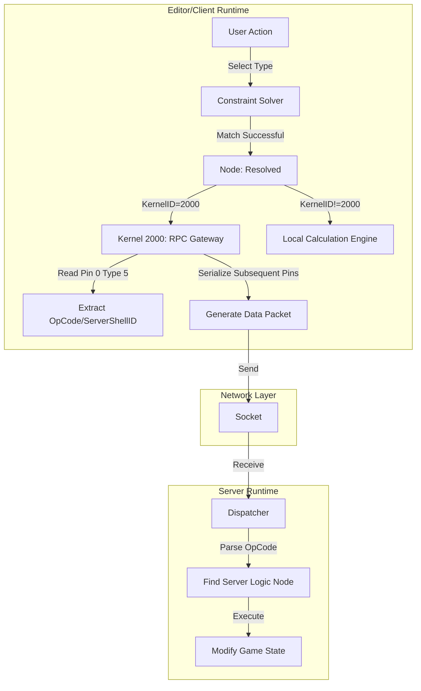

# Node Graph System Internal Architecture Documentation

## 1. System Overview

This system adopts a classic **C/S (Client-Server) decoupled architecture**. Although users operate within a unified editor, the node graph is actually divided into two subsystems running in different environments, bridged by specific communication protocols.

*   **Subsystem A (Server-side)**: **Authoritative Logic Layer**.
    *   Operating Environment: Server.
    *   Core Responsibilities: Execute actual game logic, state management, database read/write.
    *   Features: Possesses an independent ID space, logical nodes correspond one-to-one with implementations (in most cases).

*   **Subsystem B (Client-side)**: **Presentation and Proxy Layer**.
    *   Operating Environment: Client/Editor.
    *   Core Responsibilities:
        1.  **Local Computation (Pure Calc)**: Simple mathematical operations, logical judgments (without involving server state).
        2.  **RPC Proxy (Skill/Action)**: Responsible for collecting parameters and sending instructions to the server, does not execute business logic itself.
        3.  **UI Interaction**: Displays node shells.

## 2. Core Object Model: The Shell-Kernel Model

This is the most core design pattern of this system, used to solve the separation of "display" and "execution," as well as the implementation of "polymorphism."

### 2.1 Node Construction

Each node consists of three parts:

1.  **Shell (Definition)**:
    *   **Definition**: The node form seen by the user on the UI.
    *   **Responsibilities**: Defines pin layout (UI order), node name, classification.
    *   **ID**: `ShellID` (globally unique).

2.  **Kernel (Implementation)**:
    *   **Definition**: The underlying function or instruction set that is actually executed.
    *   **Responsibilities**: Receives parameter list, executes operations.
    *   **ID**: `KernelID` (unique within Server/Client).

3.  **Binding (Mapping)**:
    *   **Definition**: The bridge connecting Shell and Kernel.
    *   **Mechanism**: `Shell Pin (i1)` — `Kernel Pin (i2)`.
    *   **Rearrangement**: The pin order of the shell (for aesthetic reasons) may not be consistent with the parameter order required by the kernel (for memory layout), and the binding layer is responsible for remapping.

*   **Phenomenon Explanation**: This is why the client's "addition" and "subtraction" shells are different, but their Kernel IDs are the same. The only difference is the hidden value of Pin 0 (one points to MathOperator.ADD, the other to MathOperator.SUBTRACT).

### 2.2 Node Lifecycle States

*   **Unresolved / Dirty State**:
    *   For variable nodes (generics), when the user first drags them onto the canvas and has not selected a type, the `KernelID` is `Null`. At this point, the node cannot be executed and data lines cannot be connected.

*   **Resolved / Ready State**:
    *   After the user selects a type (e.g., `Int`), the corresponding `KernelID` (e.g., `Math_Add_Int`) is found by querying a table via the **Constraint Solver**. At this point, the node becomes valid.

## 3. Core Mechanisms

### 3.1 Client RPC Mechanism (Kernel 2000)

In Subsystem B (client), almost all "execution-type" nodes (Action/Skill) internally point to the same kernel: **Kernel 2000**.

*   **Essence**: `Kernel 2000` is a **Generic Serializer / RPC Stub**.
*   **Workflow**:
    1.  **Identify Identity**: Reads the metadata of the **Type 5 pin (Pin 0)**. This pin stores the corresponding server-side **Shell ID** (i.e., RPC OpCode).
    2.  **Package Parameters**: Iterates through all subsequent data pins, ignoring types (weak typing), and serializes them into a binary stream or JSON package.
    3.  **Send**: Sends the packet header (OpCode) and packet body (Args) to the server.

### 3.2 Signal & Dynamic Routing

`SendSignal` class nodes demonstrate the advanced dynamic characteristics of the system.

*   **Structure**:
    *   **Pin 0 (Type 5)**: **Protocol Header**. Fixed value 0 (tells the gateway its source node type via meta information).
    *   **Pin 1 (Type 5)**: **Routing Key (Topic)**. The signal name entered by the user (e.g., "PlayerDead").
    *   **Pin 0+ (Type 4)**: Signal Payload, re-bound to Kernel's Type 5 2+ via internal circuitry.

*   **Global Declaration & Index Lookup**:
    *   **Pre-declaration Mechanism**: Signals must be declared in the global signal registry before use, rather than being generated just-in-time (JIT).
    *   **Dynamic ID Assignment**: During the declaration phase, the system assigns a unique dynamic ID to each signal in sequence.
    *   **Lookup Mapping**: When the user enters a signal name in a node, the system performs a lookup process, mapping the name string back to the pre-allocated dynamic ID.

*   **Misalignment Phenomenon**: The client's Pin 0 (Opcode) is stripped on the server-side, and the server-side Send Signal Pin 0 directly corresponds to the client's Pin 1 (Topic).

### 3.3 Polymorphism & Constant Injection

How do variable nodes (e.g., `Add<T>`) adapt to different underlying implementations?

*   **Variant Table**: Each variable node maintains an internal table:
    *   `Map<{ Selector: Int }, KernelID>`
    *   Example: `Selector=0 (Int)` `Kernel=501`
    *   Example: `Selector=1 (Float)` `Kernel=502`

*   **Implicit Constant Injection**:
    *   Some nodes have hidden pins.
    *   When the `Variant` switches, not only is the Kernel ID switched, but the fixed default values of these hidden pins are also modified.
    *   **Case Study**: A floating-point comparison node might inject a hidden parameter of `Epsilon = 0.0001`, while an integer comparison node injects `Epsilon = 0` (this is not entirely accurate, as floating-point and integer operations are handled by different kernels).

## 4. Internal Data Structures

### 4.1 Pin Types

The system is strongly typed, divided into the following levels:

1.  **Flow**: Untyped, only controls execution order.
2.  **Data**:
    *   **Atomic Types (10+2+1 kinds)**: `Int`, `Flt`, `Bol`, `Str`, `Vec`, `Gid`, `Ety`, `Pfb`, `Fct`, `Cfg` + `Loc`, `Vss` + `Enum`.
    *   **Composite Types**: `L<T>` (List), `D<K,V>` (Map).
    *   **Reference Types**: In fact, most non-atomic types are passed internally as pointers.

Among them, enum types are only effective for shell connection selectors, used to restrict connectable node pins (and UI dropdown display), but internal enum values are universal across all enums.

### 4.2 Type Selector

*   Variable nodes determine their type via one or more dropdown menus (Selectors).
*   **Constraint Logic**: Not all combinations are valid. A global list of `S<K, V>` structs exists.
*   Only when the combination selected by the user matches an item in the list is the node valid.
*   This is essentially a static preset of a **Reflection** mechanism.

## 5. Summary: Data Flow Overview

### Key Conclusions

1.  **Type 5 is the Key**: It is the sole link (OpCode Carrier) connecting client presentation and server-side logic.
2.  **Kernel 2000 is the Bridge**: It smooths over strong typing differences and is responsible for data transfer.
3.  **Shell/Kernel Separation is Fundamental**: It allows the editor to display flexibly (Shell), while maintaining efficiency at runtime (Kernel), and elegantly handles the RPC proxy issue.